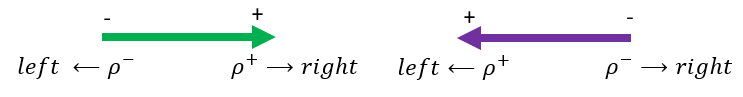
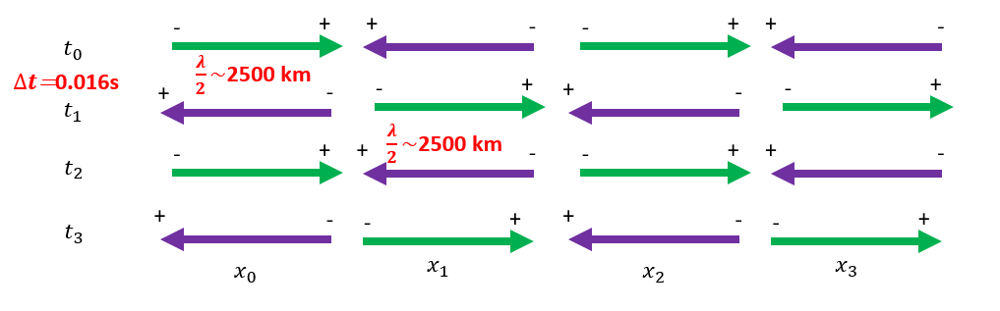
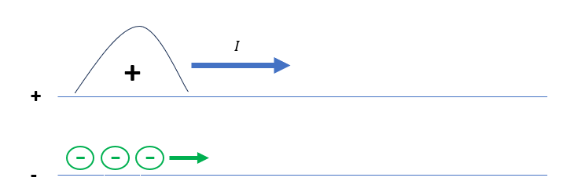
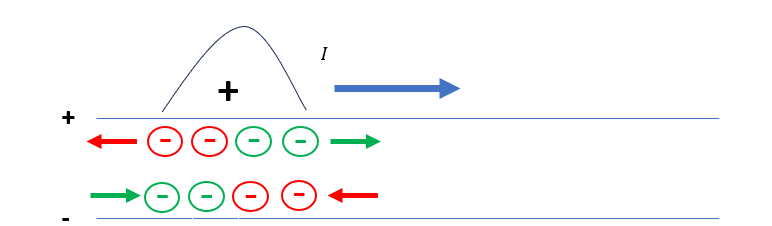
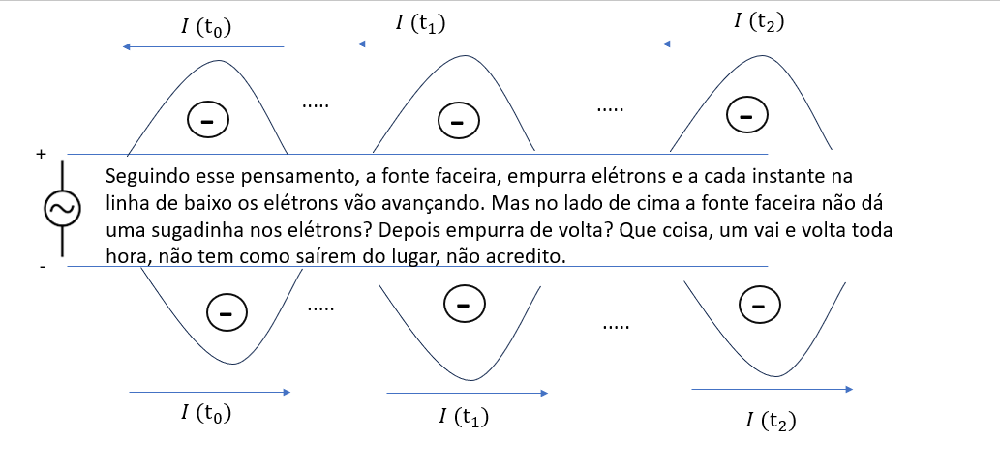
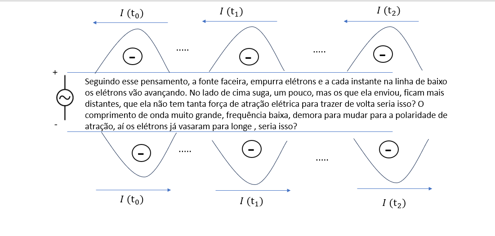
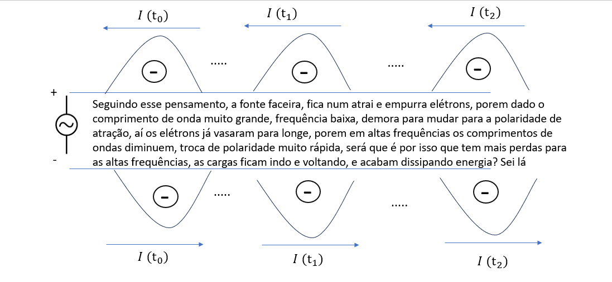

# Electical Circuits

## AC Voltage/Currents

What are current and alternating current? By definition and usual temporal analysis, it is a voltage or current signal that alternate its polarity over the time. In the spectral Analysis, we've seen that when we have alternate polarities, we eliminate the zero frequency, there is no DC components anymore, we shift the spectrum toward frequencies greater than zero, depending on the signal characteristics.

By the convention we have

Positive currents: Flow of positive charges in a given direction. 

Negative currents: Flow of negative charges in a given direction.

But we generally negate the current to indicate that it flows in the opposite direction in basic electrical circuits, without phasor conventions, right?  How can we explain all this?
Also in electrical circuits we state by the arrow convention, if the arrow is pointed to the right, the negative charges will flow to the left.

Now analyzing the current at the origin, for example, injecting an alternating current, in my head I immediately think how it is possible, if the positive charge first flows to the right, then to the left, the charges do not move out of place?

Looking at the diagram above, an alternating current of pulses, considering that at each position x the direction of the charges changes, the charges return to their initial position
(I wonder if the diagram is correct)

$x_2-x_1$= half wavelength of the pulse 1

$t_2-t_1=$ half wavelength of the pulse

In fact, we've known that physically, the negative charges travel, positive charges or holes are just a convention.

Could it be that the source pushes electrons one moment along one line, another moment along another, but as in the case of  electrical power lines the wavelength is very large, frequency of 60 Hz, so we have 1/60 seconds before getting a shock, because there are only electrons every 1/60 seconds, would it be possible? And in case of sinusoidal signals the potential in the descending cycle

Following this line of thought, the cute source pushes electrons and at every moment at the bottom line , thus the electrons move forward. But on the top side, doesn't the cute source suck the electrons in? Then, push them back? What a thing, it goes back and forth all the time, there's no way they can move from their place, how can we believe on it? 

Following this thought, the cheerful source pushes electrons and at each instant in the lower line the electrons advance. On the upper side it sucks a little, but the ones which have been sent. it stays further away, as it does not have enough electrical attraction force to bring them back. Could that be it? The very long wavelength, low frequency, takes a long time to change to the polarity of attraction, and by then the electrons have already leaked away. Could that be it?

Following this thought, the source attracts and pushes electrons, but given the very long wavelength and low frequency, it takes a while to change to the attraction polarity, and then the electrons have already leaked away, but at high frequencies the wavelengths decrease, changing polarity very quickly. Could this be why there are more losses at high frequencies, the charges go back and forth, and end up dissipating energy? I don't know.

### Calcular as Forças elétricas ao longo do cabo, tem sentido quantico? Qual relação com os campos das ondas eletromagnéticas? Nao existe irradiação a partir de corrente DC pura, só se há variação da corrente no espaço-tempo, ou por meio de corrente alternada? Porque?

Muitas dúvidas, não sei explicar, com argumentos bem físicos, o que acontece, só formulação de hipóteses, que precisam ser confirmadas se for o caso, ou refutadas com as referencias, experimentos físicos, etc

***Minha opinião raciocínio:*** Pela referência de fase (ou referência de tempo, translação no tempo infere translação de fase), como vimos nas equações de meio ciclo. Nos cicuitos elétricos básicos não fasoriais e circuito CC, as correntes tem a mesma fase sempre, se negada, a oposição de corrente ocorre sempre.

Mas o que significa diferença de fase em termos de fluxo de cargas elétricas no tempo e no espaço? Pela referência de fase (ou referência de tempo, translação no tempo infere translação de fase), como vimos nas equações de meio ciclo.

Mas o que significa diferença de fase em termos de fluxo de cargas elétricas no tempo e no espaço?

## Network Analysis - S-Parameters

S-parameters are commonly used to analyze newtork dynamics, because it takes into account the foward/backward waves or power travelling into the lines. However other techniques as Impedance/Admittance and ABCD parameters are also used as needed for a given application, but s-parameters are usually the core among those transformations, because it deals with the concept of travelling waves, with foward and backward direction.
We gonna see that the forward or backward waves, as we've seen in previous section, it can have positive or negative polarity. Besides, this concept is crucial, because the foward waves that "really" carry the usefull power to the load or to the other side of the network. The backward waves yeilds power loss to the network as we gonna see further.

### N-Port

In a N- Port System, by definition

</img>

 A link to an equation directive: {eq}`my_other_label`
$$
  w_{t+1} = (1 + r_{t+1}) s(w_t) + y_{t+1}
$$(my_other_label)